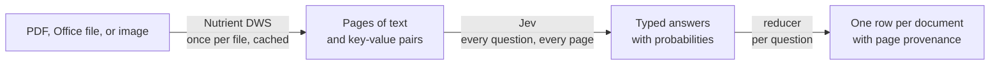

# docsignals

```
════════════════════════════════════════════════════════════════════════════════════════════════
█▀▀▀▀▀▀▀▀▀▀▀▀▀▀▀▀▀▀▀▀▀▀▀▀▀▀▀▀▀▀▀▀▀▀▀▀▀▀▀▀▀▀▀▀▀▀▀▀▀▀▀▀▀▀▀▀▀▀▀▀▀▀▀▀▀▀▀▀▀▀▀▀▀▀▀▀▀▀▀▀▀▀▀▀▀▀▀▀▀▀▀▀▀▀█
█                                                                                              █
█       ██████╗  ██████╗  ██████╗███████╗██╗ ██████╗ ███╗   ██╗ █████╗ ██╗     ███████╗        █
█       ██╔══██╗██╔═══██╗██╔════╝██╔════╝██║██╔════╝ ████╗  ██║██╔══██╗██║     ██╔════╝        █
█       ██║  ██║██║   ██║██║     ███████╗██║██║  ███╗██╔██╗ ██║███████║██║     ███████╗        █
█       ██║  ██║██║   ██║██║     ╚════██║██║██║   ██║██║╚██╗██║██╔══██║██║     ╚════██║        █
█       ██████╔╝╚██████╔╝╚██████╗███████║██║╚██████╔╝██║ ╚████║██║  ██║███████╗███████║        █
█       ╚═════╝  ╚═════╝  ╚═════╝╚══════╝╚═╝ ╚═════╝ ╚═╝  ╚═══╝╚═╝  ╚═╝╚══════╝╚══════╝        █
█                                                                                              █
█▄▄▄▄▄▄▄▄▄▄▄▄▄▄▄▄▄▄▄▄▄▄▄▄▄▄▄▄▄▄▄▄▄▄▄▄▄▄▄▄▄▄▄▄▄▄▄▄▄▄▄▄▄▄▄▄▄▄▄▄▄▄▄▄▄▄▄▄▄▄▄▄▄▄▄▄▄▄▄▄▄▄▄▄▄▄▄▄▄▄▄▄▄▄█
════════════════════════════════════════════════════════════════════════════════════════════════

       ★  A S K   Y O U R   D O C U M E N T S .   G E T   S I G N A L S .  ★

 ┏━━━━━━━━━━━━━━━━━━━━━━━━━━━━━━━━━━━━━━━━━━━━━━━━━━━━━━━━━━━━━━━━━━━━━━━━━━━━━━━━━━━━━━━━━━━━┓
 ┃  SIGNAL MONITOR ── 3 CONTRACTS ── 2 QUESTIONS                                              ┃
 ┣━━━━━━━━━━━━━━━━━━━━━━━━━━━━━━━━━━━━━━━━━━━━━━━━━━━━━━━━━━━━━━━━━━━━━━━━━━━━━━━━━━━━━━━━━━━━┫
 ┃  msa-northwind-halden.pdf     termination_for_convenience  ███████████████░░░░░ 0.77  p.2  ┃
 ┃  nda-brightwater-corvane.pdf  governing_law = delaware     █████████░░░░░░░░░░░ 0.47  p.2  ┃
 ┃  consulting-pellucid.pdf      governing_law = california   █████████░░░░░░░░░░░ 0.44  p.3  ┃
 ┃  nda-brightwater-corvane.pdf  termination_for_convenience  ███░░░░░░░░░░░░░░░░░ 0.13  p.2  ┃
 ┗━━━━━━━━━━━━━━━━━━━━━━━━━━━━━━━━━━━━━━━━━━━━━━━━━━━━━━━━━━━━━━━━━━━━━━━━━━━━━━━━━━━━━━━━━━━━┛

         ══════════════════════════════════════════════════════════════════════════════
         PDF  ●  OFFICE  ●  IMAGES  ●  YAML PACKS  ●  TYPED ANSWERS  ●  PAGE PROVENANCE
         ══════════════════════════════════════════════════════════════════════════════
```

Ask typed questions of your documents. Get structured signals for agentic workflows, with the page each answer came from.

> **⚡ Try it in a minute, with no API keys.** Five example documents ship with their extraction already recorded. [Clone, install, run](#-try-it-in-a-minute-with-no-api-keys).

> **🤝 Contributions welcome!** Have a question that every contract, invoice, or claim form should answer? We'd love it in the standard pack. [See how to contribute](#-contributing) or just open a PR.

<br>

[](https://github.com/PSPDFKit-labs/docsignals/actions/workflows/ci.yml)


## The whole idea, in one screen

You write the questions once, in a YAML **pack**. docsignals reads each document with
[Nutrient DWS Data Extraction](https://www.nutrient.io/api/), asks every question of every page with
[Jev](https://typesafe.ai/), and gives you one row per document: the answer, how sure it is, and the
page it came from.

```yaml
# examples/packs/quickstart.yaml
name: quickstart
version: 1.0.0

questions:
  governing_law:
    ask: Which jurisdiction's law governs this agreement?
    choice:
      new_york: Governed by the laws of the State of New York
      delaware: Governed by the laws of the State of Delaware
      california: Governed by the laws of the State of California
      other: Another jurisdiction, or this page does not state a governing law
    fallback: other

  termination_for_convenience:
    noul: Either party may terminate this agreement for convenience, without cause, by giving notice.
```

```console
$ docsignals run examples/packs/quickstart.yaml examples/documents/contracts/*.pdf
doc                          governing_law          termination_for_convenience
---------------------------  ---------------------  ---------------------------
consulting-pellucid.pdf      california 0.44 (p.3)  0.32 (p.2)
msa-northwind-halden.pdf     new_york 0.40 (p.3)    0.77 (p.2)
nda-brightwater-corvane.pdf  delaware 0.47 (p.2)    0.13 (p.2)
```

Every cell is an answer, a probability, and a page number you can open to check it. JSON and CSV
output go one step further: each answer names the block of the page it came from, with its bounds
and, for a PDF, a link that opens the document at that block.

> **About the numbers on this page.** The output here, and in the banner, comes from `--fake`, an
> offline stand-in for Jev that matches keywords. It lets you try docsignals with no account, but
> its probabilities are **not calibrated**. With a Jev key, the same command returns Jev's
> calibrated probabilities. See [Status](#status) for what has and has not been verified.

## Why docsignals

| | |
|---|---|
| 🎯 **Typed answers, not prose** | A yes/no, one of your labels, or a level on your scale. Nothing to parse, nothing to prompt-engineer. |
| 📊 **A probability on every answer** | Set a threshold. Send the uncertain rows to a person. Let the rest through. |
| 📍 **Page and block provenance** | Each answer names the page that decided it and the block on that page, with a link into the PDF, so a check takes seconds. |
| 💸 **Pay for extraction once** | Extraction is cached by file content. Change a question and rerun: only the questions run again. |
| 🧾 **Questions live in YAML** | A pack is a file you review, version, and share. No code change to ask something new. |
| 🔀 **Routing built in** | Classify a mixed folder, then send each document down the pack for its type. |
| 🤖 **Built for agents** | Typed, structured output an agent can branch on. No prose to parse. |
| 🔌 **CLI and library** | One command for a folder of files, or `runPack()` inside your own TypeScript. |

## ⚡ Try it in a minute, with no API keys

The repository ships five example documents with their extraction already recorded, so nothing
here calls a paid API.

```bash
git clone https://github.com/PSPDFKit-labs/docsignals.git
```

```bash
cd docsignals && npm install
```

```bash
npm run docsignals -- run examples/packs/quickstart.yaml examples/documents/contracts/*.pdf --fake --cache-dir examples/cache
```

That prints the table above. Then open
[`examples/packs/quickstart.yaml`](examples/packs/quickstart.yaml), change a question, and run the
command again. It answers immediately: the documents are already extracted, so only the questions
run again.

## Examples

| Example | What it shows |
|---|---|
| [`quickstart.yaml`](examples/packs/quickstart.yaml) | Two questions of three contracts. Start here |
| [`contracts.yaml`](examples/packs/contracts.yaml) | A fuller contracts pack |
| [`invoices.yaml`](examples/packs/invoices.yaml) | Field extraction, with each value checked against the page |
| [`intake.yaml`](examples/packs/intake.yaml) | Routing a mixed folder by document type |
| [`library.ts`](examples/library.ts) | Library use from TypeScript |

See the [examples guide](examples/README.md) for the commands and the expected output.

## How it works



1. **Extract.** DWS turns each document into pages of text, tables, and key-value pairs. The result
   is cached by file content, so you pay for extraction once per document.
2. **Ask.** Jev answers all of a pack's questions for a page in one request. The state of the
   request is the page's DWS elements exactly as DWS returned them: each paragraph with its role,
   each table as a grid of cells, each key-value pair, each picture with its description, and the
   bounds of all of them. Jev doesn't write
   text. It returns one of three typed answers, each with a probability:
   a **noul** (yes or no), a **choice** (one of your labels), or a **score** (a level on your scale).
3. **Reduce.** A document is many pages, and a governing-law clause is on one of them. Each
   question names a reducer that folds its page answers into a document answer and keeps the page
   that decided it. See [Reducers](docs/reducers.md).
4. **Locate.** For each page that decided an answer, docsignals sends Jev the same
   elements again and asks which one supports the answer. That is one more request per
   deciding page, whatever the number of blocks. See [Block provenance](docs/reducers.md#block-provenance).

Extraction is the slow, paid step and it's cached. Questions are the fast, cheap step and they're
not. That split is what lets you iterate on a pack against a folder of documents interactively.

## Pull fields out, and check them

A pack can also extract labelled fields, and ask Jev whether the page supports each value:

```yaml
extract:
  invoice_number:
    keys: [Invoice Number, Invoice No]
    verify: true
  total_due:
    keys: [Total Due, Amount Due, Balance Due]
    verify: true
```

```console
$ docsignals run invoices.yaml invoices/*.pdf
doc               is_overdue  invoice_number   total_due
----------------  ----------  ---------------  --------------------
invoice-1042.pdf  0.11 (p.1)  INV-1042 [0.97]  USD 13,760.00 [0.97]
invoice-1043.pdf  0.63 (p.1)  INV-1043 [0.97]  USD 19,529.11 [0.97]
```

The number in brackets is the probability that the page supports the extracted value. A low
number is a field to look at by hand.

## Use your own documents

Set a Nutrient DWS key that is authorised for Data Extraction, and a Jev key:

```bash
export NUTRIENT_EXTRACTION_API_KEY=...
```

```bash
export TYPESAFE_API_KEY=...
```

```bash
npm run docsignals -- run my-pack.yaml path/to/documents/*.pdf
```

DWS accepts PDFs, Office documents, and images. Without a Jev key, add `--fake`.

| Command | What it does |
|---|---|
| `docsignals run <pack> <documents...>` | Answers the pack's questions for each document |
| `docsignals validate <pack>` | Checks a pack and lists what it asks |
| `docsignals pages <document>` | Prints the elements of each page, as Jev is asked of them |

| Option | Meaning |
|---|---|
| `--by document` \| `page` | One row per document (default), or one row per page |
| `--format table` \| `json` \| `csv` | Output format. JSON carries every probability |
| `--fake` | Answer offline with uncalibrated keyword matching |
| `--cache-dir <dir>` | Where extraction results are cached. Default: `~/.config/nutrient/docsignals/cache`, under `$XDG_CONFIG_HOME` when that is set |
| `--concurrency <n>` | Documents and pages asked at the same time. Default: 8 |
| `--timeout <ms>` | Time allowed for one Jev request. Default: 10000. Raise it for a slow local model |

## Use it as a library

```ts
import { loadPack, runPack } from '@nutrient-sdk/docsignals';

const pack = await loadPack('contracts.yaml');
const { rows } = await runPack(pack, ['msa.pdf', 'nda.pdf']);

for (const row of rows) {
  const law = row.answers.governing_law;
  if (law?.type === 'choice' && law.confidence > 0.9) {
    console.log(row.doc, law.choice, `page ${'page' in law ? law.page : '?'}`);
  }
}
```

See [Library API](docs/library.md).

## Documentation

| Guide | What it covers |
|---|---|
| [Writing packs](docs/packs.md) | Every field a pack accepts |
| [Writing good questions](docs/writing-questions.md) | Wording that gets useful answers |
| [Reducers](docs/reducers.md) | How page answers become a document answer |
| [Choosing an extraction mode](docs/choosing-a-mode.md) | Cost, quality, and a real example of the difference |
| [Library API](docs/library.md) | `loadPack`, `runPack`, and the result types |
| [Examples](examples/README.md) | Packs and documents you can run offline |
| [Eval set](eval/README.md) | Public documents with ground truth, and how to score a run |

## Structure

```
docsignals/
├── src/         # The pipeline: extract, ask, reduce, format
├── packs/       # The standard library of questions (std.yaml)
├── examples/    # Packs, documents, and recorded extractions that run offline
├── eval/        # Public documents with ground truth, and a scorer. Calls the live APIs
├── docs/        # Guides
└── test/        # The offline test suite
```

## Status

This is an early release. What has been verified, and what has not:

| | Status |
|---|---|
| DWS extraction, caching, and page building | Verified against the live DWS API on the five example documents |
| Packs, reducers, output formats, CLI | Covered by the test suite, which runs offline |
| Requests to Jev | Built on the official `@typesafe-ai/sdk`. Run against the live Jev API on the seven documents of the [eval set](eval/README.md): noul, choice, score, and field verification |
| Jev's answers on real documents | 35 of 37 correct on the [eval set](eval/README.md): 21 of 21 on three government forms and 14 of 16 on four research papers. Both misses are false positives: a figure on a page whose text says "chart" for a table, and a table on a page of plots. That is a small set, and it is **not a calibration measurement**. Treat a threshold such as `> 0.9` as a starting point until you have checked it on your own documents |
| Block provenance | Run against the live Jev API on the government forms of the eval set: for each of the five affirmed answers, Jev chose the element that holds the text. Bounds checked against the five example PDFs. The link fragment (`#page=2&zoom=100,0,153`) scrolls to the block in Chromium's PDF viewer. **Not tested in Safari or Firefox**, which can open the page without the scroll |
| npm package | Not published. Install from a clone |

Known limits:

- A page whose elements are over 50,000 characters of JSON is refused, because Jev accepts 32k
  tokens of state. Measured against the live API: 52,000 characters pass and 56,000 do not. The
  elements are 4 to 26 times the size of the page text; a table costs most. A dense form page can
  be over the limit: page 1 of IRS Form 13614-C is 64,572 characters.
- Block provenance adds one Jev request per deciding page. On the three example contracts the page
  pass is 8 requests and the block questions are 6. A page that affirms nothing gets no block request.
- A deciding page with more than 254 elements is refused: Jev accepts 255 labels in one choice, and
  the block question needs one per element plus `none`.
- A link is built for a PDF only. An Office file or an image gets `link: null`; draw its `bounds` in a viewer.
- The link assumes that DWS reports bounds at 200 DPI, which held for every document we checked.
- DWS `text` mode is not supported. It returns Markdown with no page boundaries.
- Field extraction matches labels you list. It doesn't infer a field that the document labels differently.

---

## 🤝 Contributing

Contributions are welcome! Whether it's a new question, a new reducer, an example, or a bug fix.

### Quick start

1. Fork the repo
2. Run `npm install`
3. Make your change, with a test that would fail without it
4. Run `npm run check` — the typecheck, the linter, and the tests. All of it runs offline, with no API keys
5. Submit a PR

### Quality bar

Good packs share **domain knowledge** — the kind a reviewer learns from a thousand documents:

- ✅ Questions a page can answer on its own
- ✅ Labels that spell out what counts, and a `fallback` for a page that says nothing
- ✅ Wording changes that come with a version bump and a reason
- ❌ Don't add a silent default. A missing key or an unknown field is an error
- ❌ Don't use real company or person names in an example

**See [CONTRIBUTING.md](CONTRIBUTING.md) for full guidelines.**

### Ideas welcome

Not sure what to build? Some gaps we'd love filled:

- Packs for more document types (leases, claims, purchase orders, KYC)
- More document types in the [eval set](eval/README.md), and calibration measurements on public document sets
- New reducers and output formats
- Examples in more languages than English

Open an issue to discuss before building something big!

---

## Nutrient builder resources

docsignals stands on Nutrient DWS. If you build agentic document workflows, also see:

- [Nutrient DWS API](https://www.nutrient.io/api/) — the extraction service that docsignals calls.
- [Nutrient DWS TypeScript Client](https://github.com/PSPDFKit-labs/nutrient-dws-client-typescript) — the client that docsignals is built on.
- [Nutrient DWS Python Client](https://github.com/PSPDFKit/nutrient-dws-client-python) — the same workflows from Python.
- [Nutrient DWS MCP Server](https://github.com/PSPDFKit/nutrient-dws-mcp-server) — convert, OCR, redact, sign, and extract from an agent.
- [Nutrient AI infrastructure overview](https://www.nutrient.io/ai/infrastructure/) — architecture and role mapping.

## Licence

[MIT](LICENSE) — use docsignals however you like.

## Author

[Nutrient](https://www.nutrient.io)
